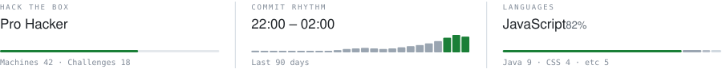

# 이진규

전북대학교 IT정보공학과

**기술과 정책을 아우르는 전문가를 희망하고 있습니다.**

<picture>
  <source media="(prefers-color-scheme: dark)" srcset="./assets/contrib-dark.svg">
  
</picture>

<picture>
  <source media="(prefers-color-scheme: dark)" srcset="./assets/stats-dark.svg">
  
</picture>

---

#### PROJECTS

`2026` 모의침투 정찰 자동화 도구 — **진행 중** 
`2026` CUITrail — 방산 공급망 컴플라이언스 플랫폼 · 국방기술품질원장상 
`2025` LLM 소스코드 보안 진단 파이프라인 — 온프레미스 배포 
`2024` JFlow — 멀티테넌트 CI/CD 플랫폼 · **운영 중** 
`2024` 교내 웹 서비스 모의해킹 
`2024` TrendCore — 커머스 웹서비스

#### WRITING

`2025` MCP 활용 토큰 효율화 기법 · 한국정보통신학회 학생우수논문상 
`2025` 로컬 LLM 취약점 분석 비교 연구 · 한국융합보안학회 우수논문상(KISA원장상)

#### BACKGROUND

`2025` Best of the Best 14기 — 보안컨설팅 트랙 
`2024` WhiteHat School 2기 
정보보안기사 · CPPG · 네트워크관리사 2급 · AWS AI Practitioner 
총장상(우수졸업생) 외 수상 7건

#### TOOLS

Python · FastAPI · React · Docker · Kubernetes · Burp Suite · Semgrep

---

[zmfltmvlt1@gmail.com](mailto:zmfltmvlt1@gmail.com) · [LinkedIn](https://www.linkedin.com/in/Jggyu) · [Portfolio](https://www.notion.so/)

<!--
**Jggyu/Jggyu** is a ✨ _special_ ✨ repository because its `README.md` (this file) appears on your GitHub profile.

Here are some ideas to get you started:

- 🔭 I’m currently working on ...
- 🌱 I’m currently learning ...
- 👯 I’m looking to collaborate on ...
- 🤔 I’m looking for help with ...
- 💬 Ask me about ...
- 📫 How to reach me: ...
- 😄 Pronouns: ...
- ⚡ Fun fact: ...
-->
